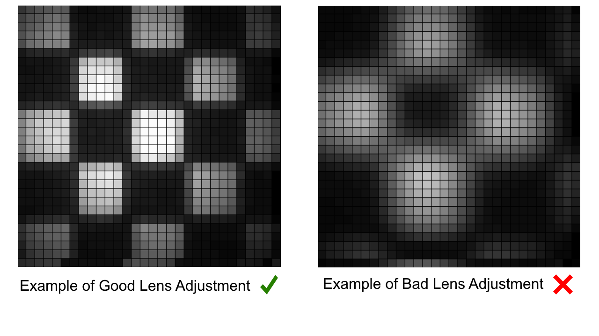

## ADNS3080 Calibration

It is very important to manually adjust the lens of the sensor to get a clear image of the checkerboard pattern of the floor and therefore get an accurate measurement.

To do this you must upload the code `image_capture_ADNS3080.ino` to the train, and then use the script `ADNS3080ImageGrabber_(PYTHON2).py`* to be able to watch the image obtained by sensor. For this, run the script and open the serial port connected to the agent. Then, in the send button of the window, send an `I` through the serial port to obtain a continuous image from the sensor.

Here is an example of how the image should look like, and also an example of a blurry image of the floor pattern:

\* *As of now this script only runs on Python 2*